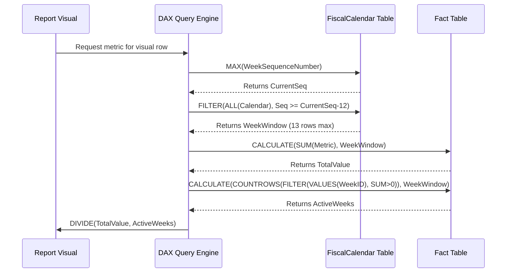

# Time Intelligence With Irregular Periods


Write a DAX measure to calculate a rolling 13-week average, but the weeks are defined by a custom fiscal calendar (not ISO weeks) stored in a separate table. Ensure the measure dynamically adjusts for partial weeks at the start/end of the dataset.

# Solution
Here’s the measure. I’m keeping it production-ready, not academic. I’ll also flag where your setup will break if you skip the basics.

### Assumptions (call these out before you paste)
- Your `FiscalCalendar` table has a `WeekSequenceNumber` column. This is a continuous integer (1, 2, 3...) that runs across your entire fiscal timeline. **Do not try to do this with date math or fiscal year/week combos.** Sequence numbers are the only reliable way to slide custom periods in DAX.
- 1:* relationship from `FiscalCalendar[Date]` → `Fact[Date]` is active and single-directional.
- "Partial weeks at dataset boundaries" means you want the divisor to shrink when the window hits the edge of your data. If your business actually wants `/13` regardless of missing edge data, change `ActiveWeeks` to `13`. Pick one and document it.

### The Measure
```dax
Rolling 13-Week Avg = 
VAR CurrentSeq = MAX('FiscalCalendar'[WeekSequenceNumber])
VAR WindowStart = CurrentSeq - 12
VAR WeekWindow = 
    FILTER(
        ALL('FiscalCalendar'),
        'FiscalCalendar'[WeekSequenceNumber] >= WindowStart && 
        'FiscalCalendar'[WeekSequenceNumber] <= CurrentSeq
    )
VAR TotalValue = CALCULATE(SUM('Fact'[Metric]), WeekWindow)
VAR ActiveWeeks = 
    CALCULATE(
        COUNTROWS(
            FILTER(
                VALUES('FiscalCalendar'[FiscalWeekID]),
                CALCULATE(SUM('Fact'[Metric])) > 0
            )
        ),
        WeekWindow
    )
RETURN DIVIDE(TotalValue, ActiveWeeks)
```

### Why this works (first-principles breakdown)
1. `ALL('FiscalCalendar')` strips any existing date filters. Rolling windows ignore slicers by design; you want the window to reach backward regardless of what’s filtered on the page.
2. Sequence-based filtering bypasses irregular month lengths, 4-4-5 calendars, or custom week start days. `CurrentSeq - 12` always grabs exactly 13 calendar weeks, no matter how many days they contain.
3. `ActiveWeeks` dynamically shrinks at dataset edges. Instead of hardcoding `/13`, it counts only the weeks inside the window that actually have transactions. This prevents volatile averages when your fact table is sparse or just starting.
4. `DIVIDE` handles empty context gracefully. No `/0` errors, no `IF` wrappers.

### Data Flow & Evaluation Context
```mermaid
flowchart TD
    A[User Filter / Slicer] --> B{DAX Engine}
    B --> C[Current Context: MAX(WeekSequenceNumber)]
    C --> D[Build WeekWindow Table\nSequence >= Max-12 && <= Max]
    D --> E[Strip Existing Date Filters\nvia ALL(Calendar)]
    E --> F[Apply WeekWindow to Model]
    F --> G[Sum Fact[Metric] across window]
    F --> H[Count distinct weeks with data\nFILTER + CALCULATE > 0]
    G --> I[DIVIDE(Sum, ActiveWeeks)]
    H --> I
    I --> J[Return Rolling Avg]
    
    classDef process fill:#f9f9f9,stroke:#333,stroke-width:1px;
    class A,B,C,D,E,F,G,H,I,J process;
```

### Calculation Pipeline (how DAX actually evaluates it)


### Reality check before you ship this
- **Gaps vs. Partial Weeks:** If a week exists in your calendar but has zero fact rows, `ActiveWeeks` skips it. That’s usually correct, but if your finance team treats missing weeks as `$0`, change the `FILTER` condition to `CALCULATE(SUM('Fact'[Metric])) >= 0` and divide by `13`. Align with business logic, not just DAX convenience.
- **Performance:** `ALL('FiscalCalendar')` is heavy on large models. If your calendar has 10+ years of daily rows, add a calculated column for `WeekSequenceNumber` and make sure it’s indexed in the data source. DAX evaluates this measure per visual row, so keep the calendar table lean.
- **Edge Case:** If your fact table starts mid-week, the first visual row will average over fewer than 7 days of data but still count as 1 full week. That’s inherent to week-level granularity. If you need day-weighted averages inside partial boundary weeks, you’re stepping into time-weighted DAX, which requires a different pattern entirely.

Drop this in, validate against a known 13-week slice, and tell me if your calendar uses 4-4-5, 52-53, or some custom override. I’ll adjust the sequence logic if your week boundaries drift.
