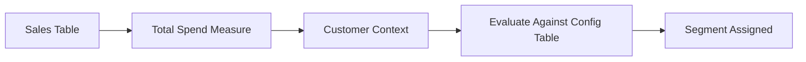
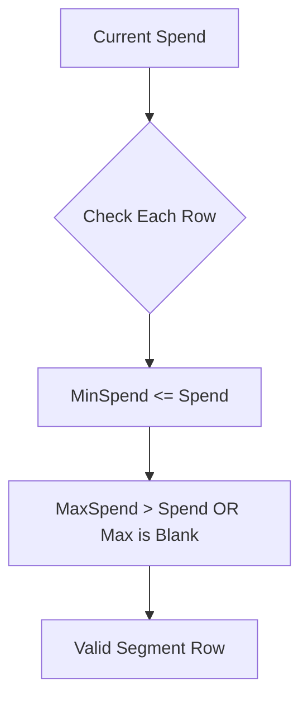
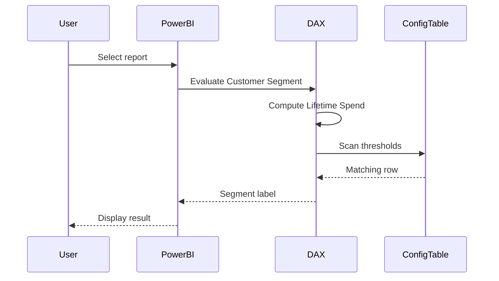

# Dynamic Segmentation With DAX


Create a measure that segments customers into "High," "Medium," and "Low" value tiers based on their lifetime spend, but the thresholds for each tier are defined in a disconnected table and can be updated by business users.

# Solution

You’re basically describing a **parameterized segmentation engine**, not just a DAX measure. The important shift: *classification logic moves from code → data*. That’s what makes it maintainable.

I’ll structure this like a system design, not just a formula.

---

# 1. Problem Restated (Correctly)

You don’t want:

* Hardcoded thresholds inside DAX
* Static segmentation logic

You want:

* A **disconnected control table** that business can edit
* A **measure-driven classification** that reacts dynamically

So the model becomes:

```
Customer Spend → Compared Against → Config Table → Returns Segment
```

---

# 2. Data Model Assumptions

### Fact Table

`Sales`

* CustomerID
* Amount

### Dimension

`Customers`

* CustomerID

### Disconnected Table (Critical)

`Customer Segmentation Config`

| Segment | MinSpend | MaxSpend |
| ------- | -------- | -------- |
| Low     | 0        | 1000     |
| Medium  | 1000     | 5000     |
| High    | 5000     | BLANK    |

No relationships. Completely disconnected.

---

# 3. Architecture Flow



---

# 4. Step 1: Lifetime Spend Measure

```DAX
Total Customer Spend :=
CALCULATE(
    SUM(Sales[Amount]),
    ALLEXCEPT(Customers, Customers[CustomerID])
)
```

### Why this matters

* `ALLEXCEPT` ensures:

  * Keeps Customer context
  * Removes slicers like Date, Product, etc.
* You get true **lifetime spend**, not filtered spend

---

# 5. Step 2: Core Segmentation Measure

This is the real engine.

```DAX
Customer Segment :=
VAR CurrentSpend = [Total Customer Spend]

RETURN
MAXX(
    FILTER(
        'Customer Segmentation Config',
        CurrentSpend >= 'Customer Segmentation Config'[MinSpend] &&
        (
            ISBLANK('Customer Segmentation Config'[MaxSpend]) ||
            CurrentSpend < 'Customer Segmentation Config'[MaxSpend]
        )
    ),
    'Customer Segmentation Config'[Segment]
)
```

---

# 6. What This Measure Actually Does

Break it down mechanically:

### Step A: Capture Spend

```
CurrentSpend = Customer Lifetime Spend
```

---

### Step B: Scan Config Table



---

### Step C: Filter Matching Row

Example:

If spend = 3200:

| Segment | Min  | Max  | Match |
| ------- | ---- | ---- | ----- |
| Low     | 0    | 1000 | No    |
| Medium  | 1000 | 5000 | Yes   |
| High    | 5000 | ∞    | No    |

---

### Step D: Return Segment

`MAXX` returns `"Medium"`

---

# 7. Why MAXX Works (Subtle but Important)

You might think:

> Why not SELECTEDVALUE?

Because:

* FILTER returns a **table**
* MAXX iterates and extracts the Segment value
* Assumes only ONE row matches

If multiple rows match → your config table is broken

---

# 8. Hidden Assumptions (Most People Miss These)

## 1. Non-overlapping ranges

Bad config:

| Segment | Min  | Max  |
| ------- | ---- | ---- |
| Medium  | 1000 | 5000 |
| High    | 4000 | 8000 |

Spend = 4500 → TWO matches → undefined behavior

---

## 2. No gaps

Bad config:

| Segment | Min  | Max  |
| ------- | ---- | ---- |
| Low     | 0    | 1000 |
| Medium  | 2000 | 5000 |

Spend = 1500 → NO match → BLANK result

---

## 3. Sorted logic is irrelevant

DAX does not care about row order
Only logical conditions matter

---

# 9. Validation Layer (You Should Add This)

To prevent silent failures:

```DAX
Segmentation Validation :=
VAR OverlapCheck =
    COUNTROWS(
        FILTER(
            'Customer Segmentation Config',
            'Customer Segmentation Config'[MinSpend] <
            CALCULATE(MAX('Customer Segmentation Config'[MaxSpend]))
        )
    )

RETURN
IF(OverlapCheck > 1, "Invalid Config", "OK")
```

---

# 10. Performance Considerations

This design scales surprisingly well because:

* Config table is tiny (3–10 rows)
* FILTER runs per evaluation but over small dataset

### Bottleneck is actually:

`[Total Customer Spend]`

Fix if needed:

* Pre-aggregate in a summary table
* Or use aggregation tables

---

# 11. Advanced Variant (More Flexible Model)

Instead of Min/Max, use ranking:

| Segment | Threshold |
| ------- | --------- |
| Low     | 0         |
| Medium  | 1000      |
| High    | 5000      |

Then logic becomes:

* Find highest threshold <= spend

```DAX
Customer Segment (Ranked) :=
VAR Spend = [Total Customer Spend]

RETURN
MAXX(
    TOPN(
        1,
        FILTER(
            'Customer Segmentation Config',
            Spend >= 'Customer Segmentation Config'[Threshold]
        ),
        'Customer Segmentation Config'[Threshold],
        DESC
    ),
    'Customer Segmentation Config'[Segment]
)
```

### Why this is better

* No gaps
* No overlap issues
* Easier for business users

Tradeoff:

* Slightly less explicit than Min/Max ranges

---

# 12. End-to-End Flow



---

# 13. What You Actually Built

Not just segmentation.

You built:

* A **rule engine inside Power BI**
* A **business-editable classification system**
* A **decoupled logic architecture**

This pattern generalizes to:

* Risk scoring
* Pricing tiers
* SLA classification
* Customer health scoring

---

# 14. Where This Breaks

Be honest about limits:

### 1. Multi-dimensional segmentation

If segmentation depends on:

* Spend + Frequency + Recency

This pattern becomes messy
You need a scoring model instead

---

### 2. Real-time write-back

If business wants UI sliders → this needs:

* Power Apps
* Write-back tables

---

### 3. Massive customer base + DirectQuery

Repeated evaluation can get expensive

Workaround:

* Precompute segment in ETL for large models

---

# 15. Bottom Line

This is not a DAX trick. It’s a **design pattern**:

> Move business logic from code → data → evaluation layer

Once you internalize that, you stop writing rigid measures and start building **configurable systems inside Power BI**.

If you want, I can push this into:

* percentile-based segmentation
* RFM model
* ML-driven clustering fallback

Those are natural next steps beyond rule-based segmentation.
