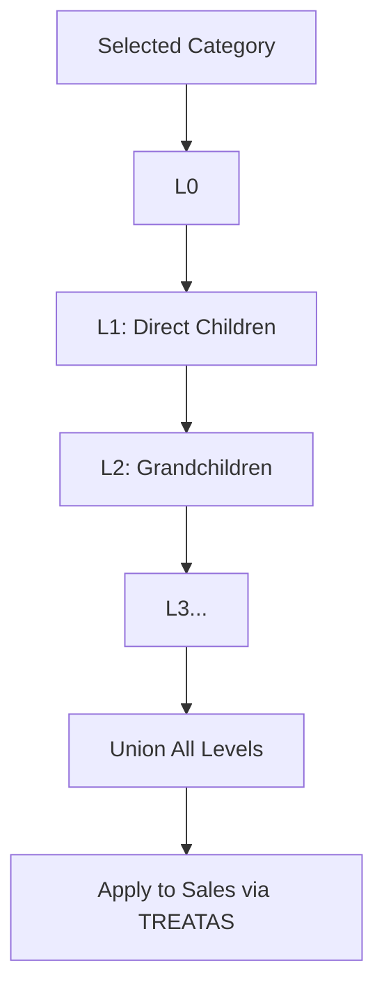

# Recursive DAX For Hierarchical Data


Write a DAX measure to calculate the total sales for a product category and all its subcategories, where the hierarchy is stored in a parent-child table. Avoid using PATH functions.

You’re asking for “recursive DAX,” but DAX does not support recursion. So the real problem is:

> How do you simulate recursion over a parent-child hierarchy **without PATH functions**?

That forces you into a **set-expansion strategy** using iterative table construction.

# 1. Reframe the Problem Properly

You have a table like:

### `Product Category`

| CategoryID | ParentCategoryID | Name        |
| ---------- | ---------------- | ----------- |
| 1          | BLANK            | Electronics |
| 2          | 1                | Phones      |
| 3          | 2                | Smartphones |
| 4          | 1                | TVs         |

And a fact table:

`Sales[CategoryID], Sales[Amount]`

Goal:

```text
If user selects "Electronics"
→ include Electronics + Phones + Smartphones + TVs
→ sum all their sales
```


# 2. Why PATH Is Usually Used

`PATH()` gives you ancestor chains.

You explicitly banned it, so:

* No string-based traversal
* No built-in hierarchy flattening

So we must **build the descendant set manually**


# 3. Core Idea (This Is the Trick)

Instead of walking **up**, we expand **downward**:

> Start with selected node → iteratively find children → union results

DAX cannot loop, so we simulate levels.


# 4. Assumption (Critical)

You must define a **maximum hierarchy depth**

If you don’t, this becomes impossible in pure DAX.

Example assumption:

```text
Max depth = 5
```


# 5. Measure: Recursive Expansion Without PATH

```DAX
Total Sales (Hierarchy) :=
VAR SelectedCategory =
    SELECTEDVALUE('Product Category'[CategoryID])

-- Level 0 (self)
VAR L0 =
    FILTER(
        ALL('Product Category'),
        'Product Category'[CategoryID] = SelectedCategory
    )

-- Level 1
VAR L1 =
    FILTER(
        ALL('Product Category'),
        'Product Category'[ParentCategoryID] IN SELECTCOLUMNS(L0, "ID", [CategoryID])
    )

-- Level 2
VAR L2 =
    FILTER(
        ALL('Product Category'),
        'Product Category'[ParentCategoryID] IN SELECTCOLUMNS(L1, "ID", [CategoryID])
    )

-- Level 3
VAR L3 =
    FILTER(
        ALL('Product Category'),
        'Product Category'[ParentCategoryID] IN SELECTCOLUMNS(L2, "ID", [CategoryID])
    )

-- Level 4
VAR L4 =
    FILTER(
        ALL('Product Category'),
        'Product Category'[ParentCategoryID] IN SELECTCOLUMNS(L3, "ID", [CategoryID])
    )

-- Combine all levels
VAR AllNodes =
    UNION(L0, L1, L2, L3, L4)

RETURN
CALCULATE(
    SUM(Sales[Amount]),
    TREATAS(
        SELECTCOLUMNS(AllNodes, "CategoryID", [CategoryID]),
        Sales[CategoryID]
    )
)
```


# 6. What This Is Actually Doing

## Step Expansion Model




# 7. Why TREATAS Is Essential

You built a **virtual table of CategoryIDs**

Now you must inject it into the filter context:

```text
AllNodes → becomes → filter on Sales
```

Without `TREATAS`, nothing propagates.


# 8. Subtle Behavior Most People Miss

## 1. This is NOT true recursion

It is:

> Manual breadth expansion with fixed depth

If depth exceeds your levels → silent truncation


## 2. Performance tradeoff

Each level does:

```text
Full scan of Product Category table
```

So complexity roughly:

```text
O(depth × table size)
```

Fine for small hierarchies, breaks at scale


## 3. Duplicates risk

If your hierarchy is not a strict tree (DAG instead), you can get:

* Duplicate nodes
* Double counting

Fix:

```DAX
VAR AllNodes =
    DISTINCT(UNION(L0, L1, L2, L3, L4))
```


# 9. Better Mental Model

Think of this as:

```text
SQL recursive CTE → manually unrolled
```

Equivalent SQL would be:

```sql
WITH RECURSIVE tree AS (
  SELECT CategoryID FROM Category WHERE CategoryID = X
  UNION ALL
  SELECT c.CategoryID
  FROM Category c
  JOIN tree t ON c.ParentCategoryID = t.CategoryID
)
```

You just hardcoded the recursion depth.


# 10. When This Approach Breaks

### 1. Unknown / deep hierarchies

You cannot scale depth dynamically


### 2. Large category tables

Repeated scans become expensive


### 3. Real-time slicing across many nodes

This measure recomputes per evaluation context


# 11. Smarter Alternative (If You Care About Scale)

Instead of forcing DAX:

## Precompute a bridge table

| Parent | Child |
| ------ | ----- |
| 1      | 1     |
| 1      | 2     |
| 1      | 3     |
| 1      | 4     |
| 2      | 2     |
| 2      | 3     |

Then your measure becomes trivial:

```DAX
Total Sales :=
CALCULATE(
    SUM(Sales[Amount]),
    TREATAS(
        VALUES(Bridge[Child]),
        Sales[CategoryID]
    )
)
```


## Tradeoff

| Approach     | Pros           | Cons                   |
| ------------ | -------------- | ---------------------- |
| Pure DAX     | No ETL needed  | Fragile, depth-limited |
| Bridge Table | Fast, scalable | Requires preprocessing |


# 12. Final Take

You asked for recursion in DAX. The honest answer:

> DAX cannot recurse. It can only **simulate recursion via controlled expansion**.

So the real decision is architectural:

* If hierarchy is shallow and static → this measure is fine
* If hierarchy is deep or business-critical → move logic upstream
