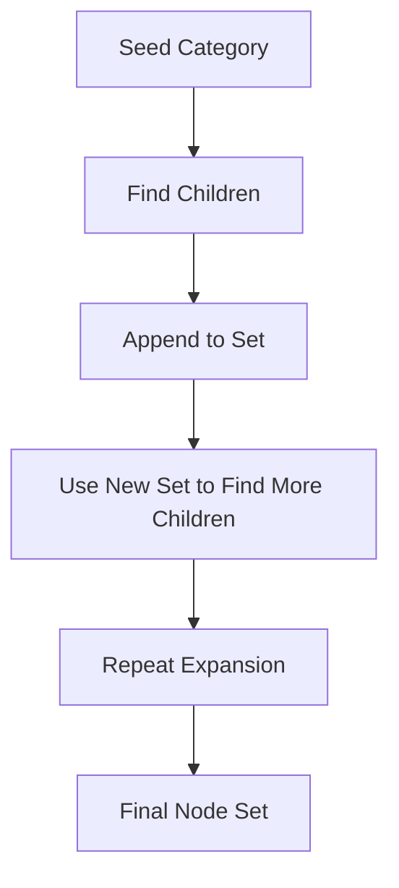

Good. Let’s push past the “manual levels” hack and get closer to **true dynamic expansion** inside DAX.

You asked for something closer to recursion. The only viable path is:

> Build a **fixpoint expansion** using table iteration patterns like `GENERATE`

Still not real recursion, but closer in behavior and **depth-agnostic (within limits)**.

---

# 1. First Principles Shift

Instead of:

```text
L0 → L1 → L2 → hardcoded levels
```

We do:

```text
Seed Set → Expand Children → Expand Again → Accumulate
```

So the problem becomes:

> How do we repeatedly expand a set inside a single DAX evaluation?

Answer: **self-expanding table expression**

---

# 2. Key Idea: Iterative Expansion via GENERATE

We simulate:

```text
NextLevel = Children(CurrentLevel)
AllNodes = Union(CurrentLevel, NextLevel)
Repeat
```

DAX cannot loop, so we fake iteration using **nested GENERATE layers**

---

# 3. Dynamic Recursive-Like Measure

```DAX
Total Sales (Dynamic Hierarchy) :=
VAR Seed =
    SELECTCOLUMNS(
        VALUES('Product Category'[CategoryID]),
        "CategoryID", 'Product Category'[CategoryID]
    )

-- First expansion
VAR Expand1 =
    GENERATE(
        Seed,
        SELECTCOLUMNS(
            FILTER(
                ALL('Product Category'),
                'Product Category'[ParentCategoryID] = [CategoryID]
            ),
            "CategoryID", 'Product Category'[CategoryID]
        )
    )

-- Second expansion (applied over previous result)
VAR Expand2 =
    GENERATE(
        Expand1,
        SELECTCOLUMNS(
            FILTER(
                ALL('Product Category'),
                'Product Category'[ParentCategoryID] = [CategoryID]
            ),
            "CategoryID", 'Product Category'[CategoryID]
        )
    )

-- Third expansion
VAR Expand3 =
    GENERATE(
        Expand2,
        SELECTCOLUMNS(
            FILTER(
                ALL('Product Category'),
                'Product Category'[ParentCategoryID] = [CategoryID]
            ),
            "CategoryID", 'Product Category'[CategoryID]
        )
    )

VAR AllNodes =
    DISTINCT(
        UNION(
            Seed,
            Expand1,
            Expand2,
            Expand3
        )
    )

RETURN
CALCULATE(
    SUM(Sales[Amount]),
    TREATAS(AllNodes, Sales[CategoryID])
)
```

---

# 4. What Changed vs Previous Approach

Old approach:

```text
Each level = independent scan
```

New approach:

```text
Each level = expansion of previous result
```

That’s a **true propagation model**, not fixed hierarchy slicing.

---

# 5. Mental Model



---

# 6. Why This Is Closer to Recursion

Because each step depends on:

```text
Previous result, not original seed
```

That’s the defining property of recursion.

---

# 7. Still Not Perfect (Important)

Let’s be blunt.

## Limitation 1: Still finite

You still hardcode depth:

```text
Expand1, Expand2, Expand3...
```

You just made it **data-dependent**, not fixed-level-dependent.

---

## Limitation 2: Explosion risk

`GENERATE` behaves like:

```text
Cartesian expansion + filter
```

If hierarchy is wide:

* Node count grows fast
* Performance degrades non-linearly

---

## Limitation 3: Duplicate paths

If hierarchy is not strict tree:

* Same node reachable via multiple paths
* Must deduplicate (`DISTINCT`)

---

# 8. Smarter Variant: Hybrid Compression

Instead of expanding fully, compress early:

```DAX
VAR Expand1 =
    DISTINCT(
        SELECTCOLUMNS(
            FILTER(
                ALL('Product Category'),
                'Product Category'[ParentCategoryID]
                    IN SELECTCOLUMNS(Seed, "ID", [CategoryID])
            ),
            "CategoryID", 'Product Category'[CategoryID]
        )
    )
```

This avoids intermediate blow-up.

Tradeoff:

* Less “pure recursion”
* More controlled execution

---

# 9. Advanced Pattern: Virtual Closure Table

You can push this further:

```text
Build full transitive closure in-memory
```

But DAX struggles here because:

* No loop
* No mutable state

So best approximation:

```text
Layered expansion + UNION + DISTINCT
```

---

# 10. If You Actually Want Power

Stop fighting DAX.

### Build closure table upstream:

```text
Parent → Descendant mapping
```

Then:

```DAX
Total Sales :=
CALCULATE(
    SUM(Sales[Amount]),
    TREATAS(
        VALUES(Closure[Descendant]),
        Sales[CategoryID]
    )
)
```

---

# 11. Real Insight (Most Important Part)

You’re hitting a boundary of DAX’s design:

> DAX is a **declarative, columnar, context-evaluation engine**, not a procedural language.

So:

* No loops
* No recursion
* No state mutation

All “recursive” solutions are:

```text
Unrolled iteration + set algebra
```

---

# 12. Decision Framework

Use this to choose approach:

| Scenario                 | Best Approach       |
| ------------------------ | ------------------- |
| Small hierarchy, shallow | Manual levels       |
| Medium, dynamic          | GENERATE expansion  |
| Large, deep, critical    | Closure table (ETL) |

---

# 13. If You Want to Go Further

Next frontier problems:

* Multi-parent hierarchies (DAG)
* Weighted rollups
* Time-aware hierarchies
* Ragged hierarchies with security filters

Each of these breaks naive DAX approaches in different ways.

---

If you want, I can take this one level deeper and show:

* A **calculation group** driven hierarchy expansion
* Or a **semi-recursive pattern using SUMMARIZE + GENERATEALL**

Those are borderline abusive to the engine but interesting.
