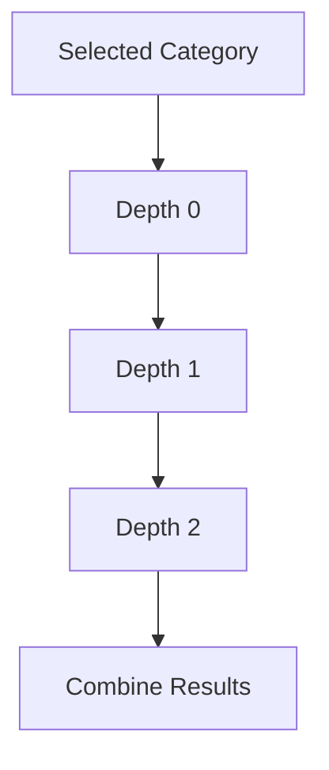
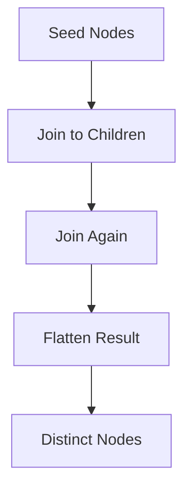

Alright, now we’re in the “abuse the engine a bit” territory.

You asked for deeper patterns, so here are two that actually stretch DAX to its edge:

1. **Calculation group driven hierarchy expansion**
2. **Semi-recursive expansion using GENERATEALL + SUMMARIZE**

These are not just variants. They change *how evaluation propagates*.

---

# 1. Calculation Group Driven Expansion

## Core Idea

Instead of expanding hierarchy inside one measure, you:

> Turn “expansion depth” into an evaluation dimension

So the engine evaluates:

```text
Depth 0 → Depth 1 → Depth 2 → Aggregate
```

---

## Conceptual Model



---

## Step 1: Create a Depth Table

`Depth Levels`

| Depth |
| ----- |
| 0     |
| 1     |
| 2     |
| 3     |
| 4     |

No relationships.

---

## Step 2: Calculation Group

Create a calculation group: **"Hierarchy Expansion"**

### Calculation Item Expression:

```DAX
VAR CurrentDepth = SELECTEDVALUE('Depth Levels'[Depth])

VAR BaseSet =
    VALUES('Product Category'[CategoryID])

VAR ExpandedSet =
    SWITCH(
        TRUE(),

        CurrentDepth = 0,
            BaseSet,

        CurrentDepth = 1,
            SELECTCOLUMNS(
                FILTER(
                    ALL('Product Category'),
                    'Product Category'[ParentCategoryID] IN BaseSet
                ),
                "CategoryID", 'Product Category'[CategoryID]
            ),

        CurrentDepth = 2,
            SELECTCOLUMNS(
                FILTER(
                    ALL('Product Category'),
                    'Product Category'[ParentCategoryID]
                    IN
                    SELECTCOLUMNS(
                        FILTER(
                            ALL('Product Category'),
                            'Product Category'[ParentCategoryID] IN BaseSet
                        ),
                        "ID", 'Product Category'[CategoryID]
                    )
                ),
                "CategoryID", 'Product Category'[CategoryID]
            )
    )

RETURN
CALCULATE(
    SELECTEDMEASURE(),
    TREATAS(ExpandedSet, 'Product Category'[CategoryID])
)
```

---

## Step 3: Final Measure

```DAX
Total Sales (Calc Group Driven) :=
SUMX(
    VALUES('Depth Levels'[Depth]),
    [Total Sales Base]
)
```

---

## Why This Is Interesting

You just turned:

```text
Recursion → Dimension-driven evaluation
```

The engine now:

* Evaluates each depth independently
* Aggregates results afterward

---

## Tradeoffs

### Pros

* Modular
* Reusable across measures
* Debuggable per depth

### Cons

* Still finite depth
* Verbose logic explosion
* Hard to maintain beyond 4 to 5 levels

---

# 2. Semi-Recursive Pattern Using GENERATEALL

This one is more “functional programming” inside DAX.

---

## Core Idea

> Expand all reachable nodes by repeatedly joining the table to itself in a single expression

---

## Measure

```DAX
Total Sales (Semi-Recursive) :=
VAR Seed =
    SELECTCOLUMNS(
        VALUES('Product Category'[CategoryID]),
        "CategoryID", 'Product Category'[CategoryID]
    )

VAR Expansion =
    GENERATEALL(
        Seed,
        GENERATEALL(
            SELECTCOLUMNS(
                FILTER(
                    ALL('Product Category'),
                    'Product Category'[ParentCategoryID] = [CategoryID]
                ),
                "CategoryID", 'Product Category'[CategoryID]
            ),
            SELECTCOLUMNS(
                FILTER(
                    ALL('Product Category'),
                    'Product Category'[ParentCategoryID] = [CategoryID]
                ),
                "CategoryID", 'Product Category'[CategoryID]
            )
        )
    )

VAR AllNodes =
    DISTINCT(
        UNION(
            Seed,
            Expansion
        )
    )

RETURN
CALCULATE(
    SUM(Sales[Amount]),
    TREATAS(AllNodes, Sales[CategoryID])
)
```

---

## What GENERATEALL Is Doing

Think of it as:

```text
For each row → expand → then expand again
```

---

## Mental Model



---

## Why This Feels “Recursive”

Because:

* Expansion is nested
* Each layer depends on prior expansion
* Not fixed per level explicitly

---

## But Here’s the Catch

This is not true recursion. It’s:

```text
Nested expansion depth = number of GENERATEALL layers
```

So:

* More layers → deeper traversal
* But complexity explodes fast

---

# 3. Comparison of All Approaches

| Approach      | Depth Flexibility | Performance | Maintainability |
| ------------- | ----------------- | ----------- | --------------- |
| Manual Levels | Low               | High        | High            |
| GENERATE      | Medium            | Medium      | Medium          |
| Calc Group    | Medium            | Medium      | Low             |
| GENERATEALL   | Medium            | Low         | Low             |
| Closure Table | Infinite          | High        | High            |

---

# 4. Non-Obvious Insight

All these approaches fail for the same reason:

> DAX cannot compute a **transitive closure dynamically**

That’s the real missing primitive.

Everything you’ve seen is:

```text
Approximating closure with repeated expansion
```

---

# 5. If You Want a Real Breakthrough

Instead of fighting DAX, change the representation.

### Encode hierarchy as:

```text
Adjacency List → Closure Table → Bitmask / Path Encoding
```

Example unconventional idea:

* Assign each node a **bitmask**
* Children inherit OR-combined mask
* Filter using bitwise operations

Not native in DAX, but doable upstream.

---

# 6. Practical Recommendation

Be blunt about it:

* If this is interview / demo → use GENERATE pattern
* If this is production → build closure table
* If this is massive model → pre-aggregate

---

# 7. Where You Can Push Further

If you really want to stress the engine:

* Combine this with **RLS filters**
* Add **time-travel hierarchies**
* Introduce **many-to-many category mappings**

That’s where most “clever” DAX solutions collapse.

---

If you want, next step I can show:

* A **fully generic hierarchy engine using calculation groups + metadata tables**
* Or a **hybrid approach with incremental refresh + precomputed hierarchy layers**

Those get closer to something you'd actually deploy at scale.
